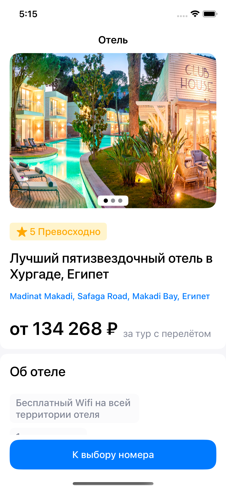
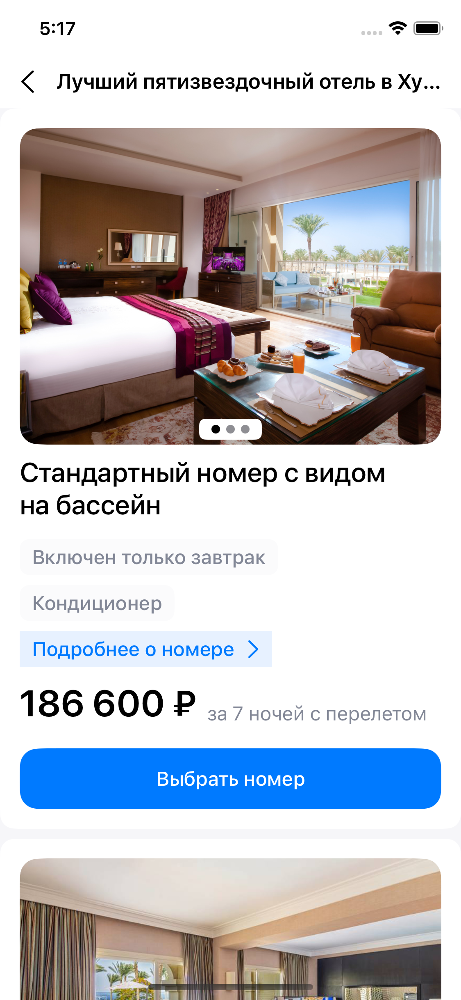
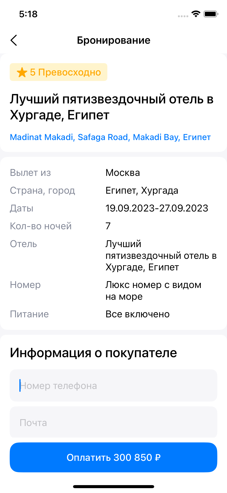
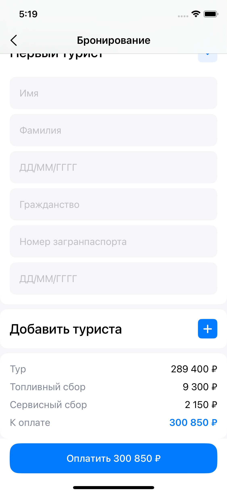
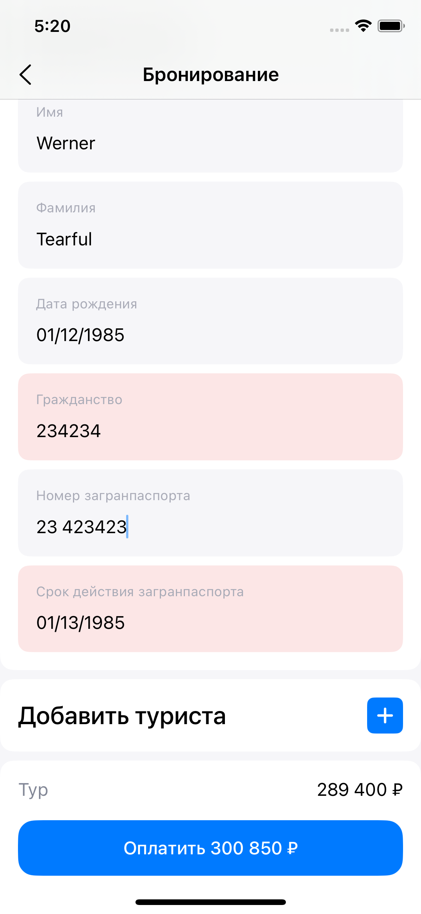

<!-- PROJECT LOGO -->
 

  <h3 align="center">Booking App README</h3>

<!-- TABLE OF CONTENTS -->

  
Table of Contents

  <ol>
    <li>
      <a href="#about-the-project">About The Project</a>
      <ul>
        <li><a href="#built-with">Built With</a></li>
      </ul>
    </li>
    <li><a href="#contact">Contact</a></li>
  </ol>

## About The Project

| Main Screen | Main Screen 2 | Hotel Room Screen | Booking Screen |
| --- | --- | --- | --- |
|  |  |  |  |
| Booking Screen 2 | Booking Screen Validation | Payment Screen | 
|  |  |  |

 

An iOS app that visually clones Spotify's app and consumes the official Spotify's Web API to show(and play) songs, artists and more. It was made as final project for IT-Academy iOS course.

Due to some limitations from Spotify WEB API, this app can play only 30 seconds of song. Some songs don't even have such preview, so I had to remove them.

Instead of using Spotify user playlist feature, I saved playlists to local database using Realm.

(<a href="#readme-top">back to top</a>)

## Built With

This app was build using MVVM-C architecture. Frameworks were integrated with Swift Package Manger. I've used Observer and Delegate paterns.

 
<ul>
    <li>Keychain</li>
    <li>UIKit</li>
    <li>AVFoundation</li>
    <li>Alamofire</li>
    <li>Realm</li>
    <li>SDWebImage</li>
    <li>Caching</li>
    <li>Dependency Injection</li>
    <li>XCode Instruments</li>
</ul>

Alamofire was used for getting and parsing data from Spotify WEB API, Realm for storing user playlists locally. SDWebImage was used for geting images by passing url to it and cache images for later use.
Cached images were used for generating average color and then passing it to generate gradient for background

## Contact
My [LinkedIn](https://www.linkedin.com/in/nicktsaruk/)
