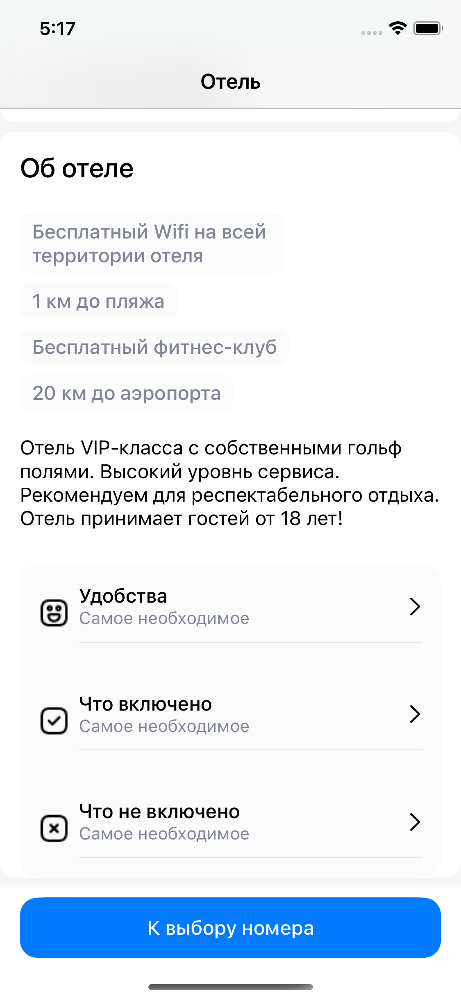

<!-- PROJECT LOGO -->
 

  <h3 align="center">Booking App README</h3>

<!-- TABLE OF CONTENTS -->

  
Table of Contents

  <ol>
    <li>
      <a href="#about-the-project">About The Project</a>
      <ul>
        <li><a href="#built-with">Built With</a></li>
      </ul>
    </li>
    <li><a href="#contact">Contact</a></li>
  </ol>

## About The Project

| Main Screen | Main Screen 2 | Hotel Room Screen | Booking Screen |
| --- | --- | --- | --- |
|  |  |  |  |
| Booking Screen 2 | Booking Screen Validation | Payment Screen | 
|  |  |  |

 

An iOS Booking app. It was made as test project.

(<a href="#readme-top">back to top</a>)

## Built With

This app was build using MVVM-C architecture and SwiftUI. Frameworks were integrated with Swift Package Manger.

 
<ul>
    <li>SwiftUI</li>
    <li>Alamofire</li>
    <li>WrappingHStack</li>
    <li>Dependency Injection</li>
    <li>XCode Instruments</li>
</ul>

Alamofire was used for getting and parsing data from mocky.io, 

## Contact
My [LinkedIn](https://www.linkedin.com/in/nicktsaruk/)
